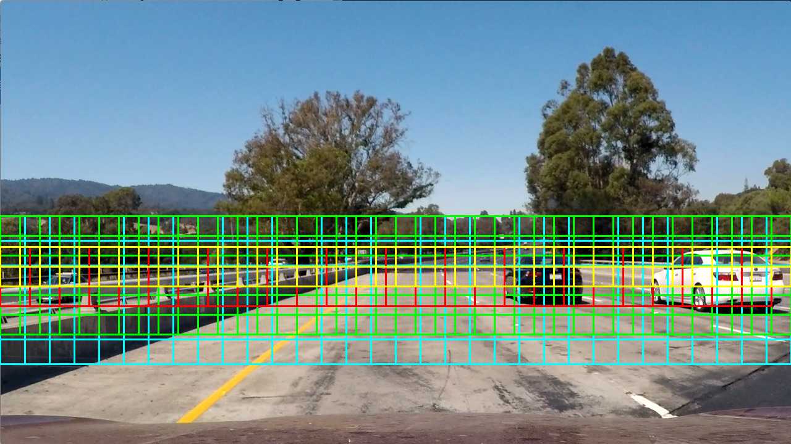
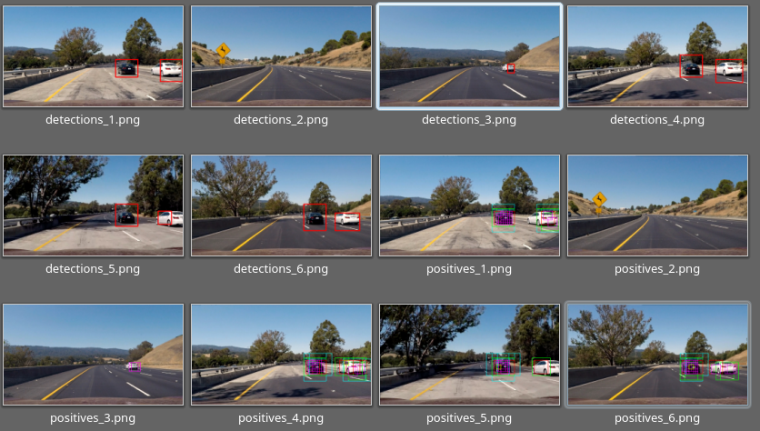

**Vehicle Detection Project**

The goals / steps of this project are the following:

* Perform a Histogram of Oriented Gradients (HOG) feature extraction on a labeled training set of images and train a classifier Linear SVM classifier
* Optionally, you can also apply a color transform and append binned color features, as well as histograms of color, to your HOG feature vector.
* Note: for those first two steps don't forget to normalize your features and randomize a selection for training and testing.
* Implement a sliding-window technique and use your trained classifier to search for vehicles in images.
* Run your pipeline on a video stream (start with the test_video.mp4 and later implement on full project_video.mp4) and create a heat map of recurring detections frame by frame to reject outliers and follow detected vehicles.
* Estimate a bounding box for vehicles detected.

[//]: # (Image References)
[image1]: ./examples/car_not_car.png
[image2]: ./examples/HOG_example.jpg
[image3]: ./output_images/Sliding-windows.png
[image4]: ./examples/sliding_window.jpg
[image5]: ./examples/bboxes_and_heat.png
[image6]: ./examples/labels_map.png
[image7]: ./examples/output_bboxes.png
[video1]: ./project_video.mp4


** 1 HOG and features extraction **

I start evaluating witch color space and number of bins are the best combination for color classification.

The best result was HSV, with size of 16x16 and 32 bins. You can see full report of different combinations in the files [one](./color_Clasifier_16_16.txt) and [two](./color_Clasifier_16_32.txt)

The code could be checked in [color_classifier.py](./color_classifier.py)

After that I've repeated the same with HOG. I did a loop with channels and color spaces, the result could be checked in the [file](./trainer_result.txt) the best combination was:

```
Starting YCrCb in channel :ALL
115.13 Seconds to extract HOG features...
Using: 9 orientations 8 pixels per cell and 2 cells per block
Feature vector length: 5292
13.69 Seconds to train SVC...
***Test Accuracy of SVC =  0.9876***
My SVC predicts:  [ 1.  0.  1.  0.  0.  1.  0.  0.  1.  1.]
For these 10 labels:  [ 1.  0.  1.  0.  0.  1.  0.  0.  1.  1.]
0.00295 Seconds to predict 10 labels with SVC
```

I started by reading in all the `vehicle` and `non-vehicle` images.  Here is an example of one of each of the `vehicle` and `non-vehicle` classes:


![alt text][image1]

I then explored different color spaces and different `skimage.hog()` parameters (`orientations`, `pixels_per_cell`, and `cells_per_block`).  I grabbed random images from each of the two classes and displayed them to get a feel for what the `skimage.hog()` output looks like.

Here is an example using the `YCrCb` color space and HOG parameters of `orientations=8`, `pixels_per_cell=(8, 8)` and `cells_per_block=(2, 2)`:


![alt text][image2]

** 2 Features selected **

At the end I've trained the model using a concatenation of features using  and the best combination of color  classifier.

You can see the feature extraction in the trainer.py file.

Using both techniques I achieve 99.3% for LUV with 3channels and SHV color space. 99.27% for YUV with 3 channels and SHV and finally, with **YCrCb and the three channels and SHV I get 99.44%**

The full report could be found at [file](./hog_spatial_color_report.txt)


** 3 Trainer **

I trained a linear SVM using LinearSVC from scikit, you can see the code in trainer.py

The first step in the training was the feature extraction, in ```extract_features``` function you can see the extraction of HOG and finally the bins and histogram extraction.

After that I use a StandardScaler from scikit to normalize all the features and finally I trained the model with `LinearSVC()`

In the main function you can see all functions calls and also a loop to test the different color spaces.

And finally the scaler and the model are saved in the file model_YCrCb__ALL.p


# Sliding Windows search

I implent the sliding window algorithm in the file search-cars.py.

Based on the code of sliding window of the lectures I have modified the code to search in several areas defined by array 'areas'

In the next image you can see in color the different analyzed areas



I searched in 4 scales using the same images processing  that I used in the training section (YCrCb and the three channels and SHV).

Applying the algorithm to the proposed images you can see the results.



As images show, there is no false positives neither non loaded cars. So the result is what I expected.

## Video Implementation

For the video Implementation I've use the same pipeline that for test images in the same file, the only difference is that all images are saved as png in the finalVideo directory, and mounted as the previous projects with video.py

The final result is located [here](./out_finalVideo.mp4)

I have used several mechanism to avoid false positives.

The first one is the heatmaps with the code proposed in lectures.

The second one gives memory between frames, I don't reset the heat map, just divide by two in order to reduce the old influence, and grow the head-map threshold to 2.

The result is very good.


---

### Discussion

I have several conclusions.
The first one is that python is not a valid language to do this kind of algorithm, it have a real parallelization mechanism, and it spend a lot of time. Every frame analysis needs up to 3 seconds.

The second one is that I can't be sure if it will work in different environment situations, like lowlight, raining, sand roads, etc.

In order to get a better result probably I can use a less accuracy but quick features, for example if I use YCrCb in channel :0 I get an accuracy of 0.9873 using colors and histograms, and alone I get 0.9485 In that conditions, the prediction time is reduced to 1/4th and the feature extraction is times faster too.
